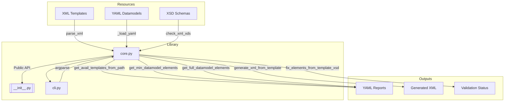
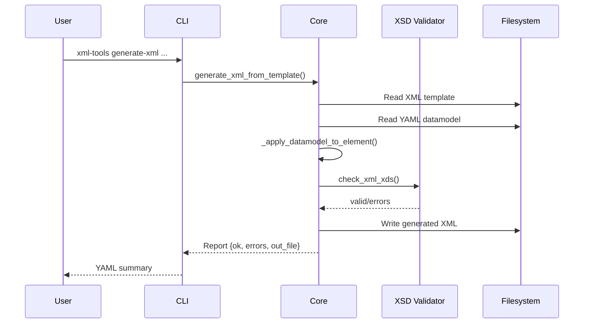

# xml-tools

Utilities to inspect XML layout templates, produce YAML-friendly datamodels, and
validate or materialise XML documents against XSD definitions. The project ships as a
reusable Python library, with an optional CLI and a fully automated CI/CD workflow.

## Features
- Discover XML templates and collect curated metadata.
- Generate both minimal and full YAML datamodels.
- Apply datamodel patches back to XML templates with XSD validation.
- Produce new XML files from YAML descriptions.
- Consume the functionality via Python API or the `xml-tools` command line tool.

## Project Structure
```
xml-tools/
|-- src/xml_tools/
|   |-- __init__.py
|   |-- core.py          # Core business logic
|   `-- cli.py           # CLI entry point
|-- tests/
|   |-- data/            # XML/XSD/YAML fixtures
|   `-- test_core.py
|-- README.md
|-- LICENSE
|-- pyproject.toml
`-- .github/workflows/ci.yml
```

## Architecture Overview


## Processing Flow


## Python API
```python
from xml_tools import (
    get_avail_templates_from_path,
    get_min_datamodel_elements,
    fix_elements_from_template_xsd,
)

metadata = get_avail_templates_from_path("templates/")
min_model = get_min_datamodel_elements("templates/sample_layout.xml")
report = fix_elements_from_template_xsd(
    "templates/sample_layout.xml",
    "datamodel.yaml",
    "schemas/"
)
```

## CLI Usage
Install the project (editable mode for development):
```bash
pip install -e .[dev]
```

List templates:
```bash
xml-tools list --path tests/data/xml_simple_sample_1
```

Generate XML while validating:
```bash
xml-tools generate-xml \
  --xml tests/data/xml_simple_sample_1/sample_layout.xml \
  --datamodel tests/data/xml_simple_sample_1/datamodel_min.yaml \
  --out-file build/generated.xml \
  --schemas-dir tests/data/xml_simple_sample_1/schemas
```

Every command accepts `--out` to write the YAML response to disk instead of stdout.

## Tests & Coverage
Pytest enforces a minimum coverage of 80%. Typical workflow:
```bash
pip install -e .[dev]
pytest --cov=xml_tools --cov-report=term-missing
```

The coverage threshold is configured via `pyproject.toml`/`coverage`.

## CI/CD Pipeline
GitHub Actions (`.github/workflows/ci.yml`) run on pushes and pull requests:
1. **Tests** — install dependencies and run `pytest` with coverage.
2. **Build** — create wheel and source distribution via `python -m build`.
3. **Release** — on successful pushes to `main`, generate/update the GitHub release tagged `v<version>` with the fresh artifacts.

Keep the project version in `pyproject.toml` up to date before merging to `main`.

## Release & Publishing
- Update the semantic version in `pyproject.toml`.
- Merge to `main`; the workflow creates or updates the `v<version>` release and uploads the build artifacts.
- Download artifacts from the release page or push them to external registries manually.

## License
Distributed under the terms of the [MIT License](LICENSE).
