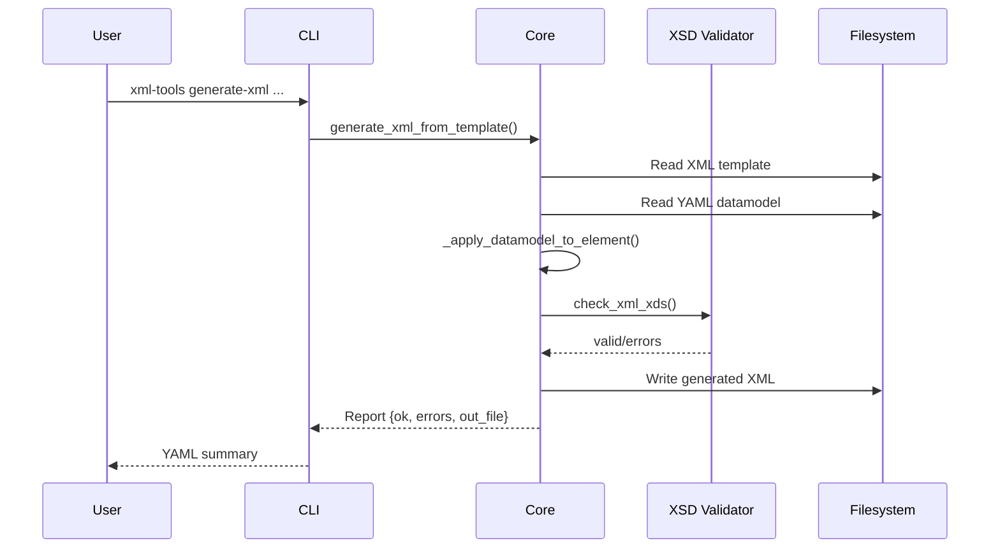

# xml-tools

Utilities to inspect XML layout templates, generate YAML-friendly datamodels, and
validate or materialise XML documents against XSD definitions. Designed as a reusable
library with a CLI wrapper and automated CI/CD pipeline.

## Features
- Discover XML templates and collect metadata snapshots.
- Produce minimal or full datamodels that are easy to diff in YAML.
- Apply datamodel patches back to XML templates and validate against XSD.
- Generate new XML files while enforcing schema requirements.
- Command line interface packaged as `xml-tools` alongside Python API.

## Project Structure
```
xml-tools/
├─ src/xml_tools/          # Library modules
│  ├─ __init__.py
│  ├─ core.py              # Business logic
│  └─ cli.py               # CLI entrypoint
├─ tests/                  # Pytest suite and fixtures
│  ├─ data/                # Sample scenarios (XML, XSD, YAML)
│  └─ test_core.py
├─ README.md
├─ LICENSE
├─ pyproject.toml
└─ .github/workflows/ci.yml
```

## Architecture Overview
```mermaid
flowchart TB
    subgraph Library
        A[core.py] -->|Public API| B[[__init__.py]]
        A --> C[cli.py]
    end
    subgraph Resources
        D[XML Templates]
        E[YAML Datamodels]
        F[XSD Schemas]
    end
    subgraph Outputs
        G[YAML Reports]
        H[Generated XML]
        I[Validation Status]
    end

    D -->|parse_xml| A
    E -->|_load_yaml| A
    F -->|check_xml_xds| A
    A -->|get_avail_templates_from_path| G
    A -->|get_min_datamodel_elements|get_full_datamodel_elements| G
    A -->|fix_elements_from_template_xsd| I
    A -->|generate_xml_from_template| H
    C -->|argparse| A
```

## Processing Flow


## Python API
```python
from xml_tools import (
    get_avail_templates_from_path,
    get_min_datamodel_elements,
    fix_elements_from_template_xsd,
)

metadata = get_avail_templates_from_path("templates/")
min_model = get_min_datamodel_elements("templates/sample_layout.xml")
report = fix_elements_from_template_xsd(
    "templates/sample_layout.xml",
    "datamodel.yaml",
    "schemas/"
)
```

## CLI Usage
Install the package (editable mode for development):
```bash
pip install -e .[dev]
```

List templates:
```bash
xml-tools list --path tests/data/xml_simple_sample_1
```

Generate XML while validating:
```bash
xml-tools generate-xml \
  --xml tests/data/xml_simple_sample_1/sample_layout.xml \
  --datamodel tests/data/xml_simple_sample_1/datamodel_min.yaml \
  --out-file build/generated.xml \
  --schemas-dir tests/data/xml_simple_sample_1/schemas
```

All commands accept `--out` to write the YAML response to disk instead of stdout.

## Tests & Coverage
Pytest is configured with a coverage gate of 80%:
```bash
pip install -e .[dev]
pytest --cov=xml_tools --cov-report=term-missing
```

Coverage is enforced through the `coverage` configuration (`fail_under = 80`).

## CI/CD Pipeline
GitHub Actions workflow (`.github/workflows/ci.yml`) runs on pushes and pull requests:
1. **Tests**: install dependencies, run `pytest` with coverage threshold.
2. **Build**: produce wheel and source distribution via `python -m build`.
3. **Release** (automatic for `main`): create or update the GitHub release tagged `v<version>` with the freshly built artifacts.

Update the version in `pyproject.toml` before merging to `main` so the release tag stays in sync.

## Release & Publishing
- Update `pyproject.toml` version.
- Commit changes, tag (`git tag v0.1.0`), and push the tag.
- The CI pipeline builds artifacts and publishes them to the corresponding GitHub release.
- Artifacts can be downloaded or promoted to other registries manually.

## License
Distributed under the terms of the [MIT License](LICENSE).
